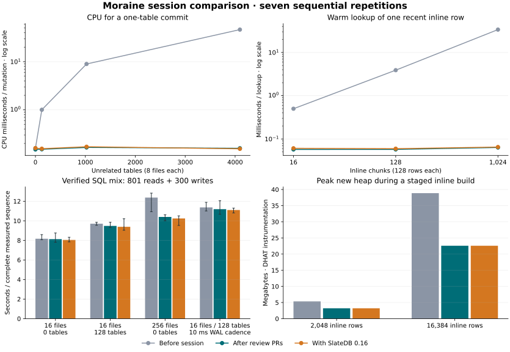

# Review-session benchmark comparison

The clearest end-to-end gain is **17.2% lower median runtime for the SQL mix
over 256 active files**: 12.376 s before the session versus 10.242 s after the
review and SlateDB upgrade. That corresponds to about 21% more sequential SQL
operations per second for this workload. The smaller SQL fixtures improve
only 1–3% by their medians, with variation too large to establish a clear gain.

Core operations improve much more: at 4,096 unrelated tables, a one-table
commit takes about 39× less elapsed time and 298× less CPU. Warm one-row
lookups become approximately flat with source count. Staged-build peak new
heap falls 42%, while normal-allocator staged-build time falls 13% in the
16,384-row case. These are workload-specific gains, not a universal multiplier.

The campaign completed **1,050 core benchmark processes and 105 verified SQL
replays**, with seven repetitions per revision and case. No SQL result or
fixture verification failed. The SlateDB upgrade alone shows no clear
additional SQL improvement within the observed variation.



Points and bars show medians; SQL whiskers show the observed minimum and
maximum across seven runs. Core CPU and lookup timing use normal allocators;
the heap panel uses separate DHAT-instrumented executions.

## End-to-end SQL results

Times exclude setup, attach, index creation, and final verification. Each mixed
sequence contains 801 successful one-row reads and 300 mutations. Unrelated
tables each contain two files; target files contain 128 rows.

| Workload | Before, s | Review, s | SlateDB 0.16, s | Final median time reduction |
| --- | ---: | ---: | ---: | ---: |
| Mix: 16 active files, no unrelated tables | 8.167 | 8.126 | 8.048 | 1.5% |
| Mix: 16 active files, 128 unrelated tables | 9.703 | 9.478 | 9.389 | 3.2% |
| Mix: 256 active files, no unrelated tables | 12.376 | 10.394 | 10.242 | **17.2%** |
| Mix: 16 active files, 128 unrelated tables, 10 ms WAL cadence | 11.370 | 11.189 | 11.103 | 2.4% |
| Bulk insert, aggregate scans, and maintenance control | 0.1647 | 0.1668 | 0.1634 | 0.8% |

Paired bootstrap resampling of the seven rounds gives an exploratory 95%
interval of **6.4–21.6% lower time** for the 256-file case. Every other SQL
case's interval includes zero improvement. These intervals describe this
small local experiment; they are not production latency guarantees. The
review PRs alone reduce the 256-file median by 16.0%; most of the observed
benefit predates the SlateDB upgrade.

The 256-file rate rises from about **89 to 107.5 sequential operations/s**.
The small-fixture and durability-delay results show why reductions in internal
CPU cannot simply be applied to total SQL latency. This campaign does not
profile which remaining DuckDB or DuckLake phase dominates those cases.

## Core results and memory

Elapsed and CPU times below come from normal-allocator binaries. Allocation
traffic and peak heap come from separate instrumented runs of the same cases.
All sizes use decimal MB and KB.

| Operation and metric | Before | Review | SlateDB 0.16 | Before → final |
| --- | ---: | ---: | ---: | ---: |
| One-table commit, 4,096 unrelated tables: elapsed | 46.290 ms | 1.171 ms | 1.177 ms | 39.3× faster |
| Same commit: process CPU | 46.332 ms | 0.159 ms | 0.155 ms | 298× less CPU |
| Same commit: allocated bytes | 54.610 MB | 0.140 MB | 0.141 MB | 99.7% lower |
| Same commit, 10 ms WAL cadence: elapsed | 52.872 ms | 11.110 ms | 11.111 ms | 4.76× faster |
| Warm file lookup, 1,024 files, one hit | 3.450 ms | 0.0254 ms | 0.0281 ms | 123× faster |
| Warm inline membership, 1,024 chunks, one hit | 9.071 ms | 0.0306 ms | 0.0306 ms | 296× faster |
| Warm recent-row lookup, 1,024 chunks, one hit | 33.748 ms | 0.0636 ms | 0.0651 ms | 518× faster |
| Same recent-row lookup through a manifest reader | 20.629 ms | 0.0780 ms | 0.0795 ms | 260× faster |
| Append 1,024 entries to a 65,536-entry index: elapsed | 7.764 ms | 2.386 ms | 2.357 ms | 3.29× faster |
| Same index append: allocated bytes | 5.913 MB | 2.904 MB | 2.911 MB | 50.8% lower |
| Staged build, 16,384 rows, 128-entry steps: elapsed | 349.612 ms | 299.895 ms | 303.352 ms | 13.2% lower |
| Same staged build: process CPU | 263.360 ms | 211.775 ms | 215.823 ms | 18.1% lower |
| Same staged build: peak new heap | 38.872 MB | 22.587 MB | 22.586 MB | 41.9% lower |

The final one-table commit without unrelated tables still takes about
1.176 ms, versus 1.168 ms before: removing catalog-size work does not remove
the durability floor. At a 10 ms cadence, the large-catalog final commit spends
almost all its time in the durability phase. Raw CPU, durability-phase time,
and physical PUT time are retained separately in the data.

The normal staged-build comparison is deliberately separate from DHAT timing.
The profiler adds substantially more overhead to the baseline's greater
allocation traffic; its apparent speedup would overstate the normal execution
gain. Reducing steps from 128 to 16 entries also limits the elapsed-time gain:
the 16,384-row build improves from 1.530 s to 1.491 s, about 2.6%.

## Regressions and tradeoffs

- Cold file lookup becomes slower in the larger tested cases: 2.358 →
  2.554 ms at 128 files (**8.3% higher**) and 12.276 → 13.101 ms at 1,024
  files (**6.7% higher**). A cold call still constructs the file directory;
  these improvements chiefly benefit reuse of that directory.
- A one-entry append to the 65,536-entry index allocates **162.1 → 180.8 KB**,
  an 11.6% increase, even though the 1,024-entry append allocates roughly half
  as much. Its elapsed time is essentially unchanged at about 1.2 ms.
- Bulk operations and small SQL fixtures show no reliable overall win in this
  experiment. Correctness fixes remain valuable independently of benchmark
  speed, and real S3 behavior remains unmeasured.

## Data and validation

- [Core measurements](session-benchmark-data/core.csv): 1,512 rows, including
  separate cold/warm records where applicable.
- [SQL replay totals](session-benchmark-data/sql-totals.csv),
  [per-phase summaries](session-benchmark-data/sql-phases.csv), and
  [individual operations](session-benchmark-data/sql-operations.csv.gz).
- [SQL comparisons and exploratory intervals](session-benchmark-data/sql-comparisons.csv).
- [Environment, artifact hashes, and harness checks](session-benchmark-data/environment.json).
- [Baseline harness patch](session-benchmark-data/before-harness.patch.gz).
- [Standalone SVG](session-benchmark-data/comparison.svg) and
  [PNG](session-benchmark-data/comparison.png).

The run used an Amazon Linux 2023 x86-64 VM, eight logical CPUs, Rust 1.96.1,
GCC 14, and release optimization. The hardware description and exact revision
and artifact hashes are included with the data. Benchmark sources match
across revisions after formatting normalization.

Validation passed: pinned formatting, workspace/all-target Clippy, workspace
tests, rustdoc with warnings denied, cargo-deny, and pin checks. The campaign
also exercised the three compiled extensions through real DuckDB, verified
all 105 SQL replays, and checked the row-lookup, index-append, and staged-build
results within the core examples. The new runner's option, ordering, timing,
and workload checks pass.

## Revisions and controls

| Label | Commit | Implementation |
| --- | --- | --- |
| Before | `b8953e99ab3d51f9a4407046999e3e84e304a7fa` | Before the first review fix, PR #191 |
| Review | `e892ff7cb0ca08cbd42582e301d00a6a2d7e644e` | Review changes through PR #198, SlateDB 0.15 |
| SlateDB 0.16 | `75100261773d7a66fb55069f3437e47ff1786765` | Review changes plus PR #199 |

The runner builds detached worktrees without changing the working branch. It
copies the common benchmark examples into each historical checkout and adds
their profiling dependencies where absent. The original baseline receives
nanosecond commit timing fields equivalent to the later revisions; no algorithm
or correctness fix is backported. Build-time lockfile and telemetry changes are
preserved in each artifact directory's `harness.patch`.

All SQL runs use the same DuckDB 1.5.5 CLI, the same built DuckLake companion,
two DuckDB threads, and a 64 MiB cache setting. The companion includes the
current patch series on every revision, including the cleanup patch; this
controls the DuckLake side while comparing Moraine. Each fixture has its own
local catalog and Parquet directory. Core examples use real SlateDB and either
in-memory object stores or, for staged builds, a local persisted store.

Each case runs seven times, with revision order rotated across rounds. Cases
run sequentially without overlapping builds or tests. Reported central values
are medians of the seven process-level measurements. Per-operation core values
are means within each process; they are not individual latency percentiles.

## Workloads

The mixed SQL sequence consists of one first lookup followed by 100 cycles of
eight located index reads, one UPDATE, one INSERT, and one DELETE: 1,101 SQL
operations in total. Every lookup verifies its hit, and the final row counts
and updated-value sum are checked. The fixture also verifies its file count.
Setup, index creation, attach, and final verification are excluded from the
measured sequence.

The mix runs with 16 target files and either zero or 128 unrelated tables
(two files each), plus a 256-target-file case with no unrelated tables. Files
contain 128 target rows; each unrelated file contains 32 rows. Every lookup
requests exactly one row. Updates each affect a distinct initial row; event
inserts and deletes cancel out. The 128-table case is repeated with a 10 ms
WAL flush cadence. This is a controlled durability scheduling delay, not
injected object-store latency or an S3 simulation.

The bulk control inserts one million rows, checks ten aggregate scans, and
merges, expires, and cleans up a separate 16-file table. Fragment creation is
untimed. Its total is the sum of the measured blocks, excluding intervening
setup.

Core cases cover:

- One-table commits with 0, 128, 1,024, or 4,096 unrelated tables and eight
  files per table; the endpoints also run with a 10 ms flush cadence.
- One-hit file, inline membership, and recent-row lookups with 16, 128, or
  1,024 sources, including cold and warm calls and manifest-following readers.
- One-entry and 1,024-entry index appends to indexes containing 1,024 or
  65,536 entries, verifying every appended range.
- Complete staged inline index builds with varied source counts, chunk sizes,
  and step sizes, verifying the published index.

## Timing and memory interpretation

Normal core binaries retain the system allocator. Separate instrumented
binaries install `stats_alloc` to measure allocation traffic; their latency
does not supply the normal-build timing comparison. Process CPU includes
background SlateDB work during the measurement window. The commit harness
reports durability-phase time and physical PUT time separately: the former
includes validation and WAL scheduling and is not pure storage-service time.

DuckDB's CLI rounds individual wall times to milliseconds. Microsecond
timestamp boundaries bracket contiguous measured SQL blocks to obtain the
headline total independently of those rounded values. These totals include
SQL dispatch and result output inside the blocks. Per-phase CPU comes from
the CLI's user and system CPU counters; individual wall-time percentiles retain
millisecond resolution. These are sequential workload rates, not a concurrent
server throughput test.

The staged-build memory example uses DHAT in a separate process. Its peak is
the maximum live size of allocations made during the complete operation,
including background work. It excludes allocations made before profiling,
allocator overhead, and RSS. Cumulative allocated bytes and peak live heap are
different quantities. Native allocator traffic is outside these Rust allocator
measurements. A separate normal-allocator variant of the staged workload
measures operation CPU and elapsed time; instrumented staged-build time is
diagnostic.

## Reproduce

Install the repository toolchains and initialize its submodules, then build
the native prerequisites with `cargo xtask e2e`. Allow disk space for three
sets of binaries and a shared native build tree, in addition to ordinary
repository build caches.

```bash
CARGO_INCREMENTAL=0 cargo xtask session-bench --phase build
CARGO_INCREMENTAL=0 cargo xtask session-bench --phase core --repeat 7
CARGO_INCREMENTAL=0 cargo xtask session-bench --phase sql --repeat 7
```

`--phase all` performs these stages in order. `--root DIRECTORY` relocates the
artifacts and raw results; the default is `target/session-bench`. The build
stage fetches the historical dependencies before locked release builds. SQL
cases that fail validation are recorded in `sql-failures.csv` and excluded
from timings. Core case failures stop the run. Raw SQL, stdout, per-statement
timings, and per-process core measurements remain under the output root.

`--phase sql-files` runs only the 256-file mix into separate `sql-files*`
outputs. It was added after the original SQL cases completed in this campaign;
both sets of measurements are included in the accompanying data.
`--phase build-time` rebuilds and runs only the normal-allocator staged-build
measurements; these were collected after the primary core matrix. Both case
families are part of a fresh full campaign.

## Scope

This synthetic mix is a stated workload, not a production workload weighting
or a universal Moraine speedup. Microbenchmark ratios must not be multiplied
together. Correctness improvements are checked rather than assigned a speedup.

Actual S3 comparisons require an authorized benchmark bucket and AWS access.
This VM has neither configured; its GitHub token also cannot read repository
benchmark variables. Local and controlled-cadence measurements do not establish
remote-store latency or S3 throughput.
